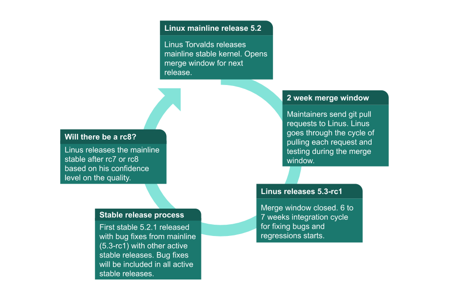

# Kernel Hacking

Learning about Linux Kernel development

## Linux Foundation Course

- [Class Forum](https://forum.linuxfoundation.org/categories/lfd103-class-forum)

### Linux Kernel Development Process

While the kernel development is a continuous process, at certain points during the development, when a set of features and bug fixes are ready, a new version of the kernel is released. These new versions are called kernel releases. Linus Torvalds releases a new kernel and opens a 2-week merge window. During this merge window, he pulls code for the next release from subsystem maintainers. Subsystem maintainers send signed git pull requests to Linus either during the merge window or before. All major new development is added to the kernel during the merge window.10,000+ change sets (patches) get pulled into Linus's tree during these 2 weeks, at the end of which he releases the first release candidate, known as rc1.

At this point, the release cycle moves into a bug fixes-only mode, with a series of release candidate (rc) releases from Linus. One week after rc1 is released, rc2 comes out; rc3 comes out a week after, and so on, until all major bug fixes and regressions (if any) are resolved.

A new cycle begins with 3 weeks of quiet period, which starts a week before the release, and continues through the 2-week merge window. Maintainers and key contributors are busy getting their trees ready to send pull requests to Linus. Please note that the quiet period isn't formalized, and each sub-system might handle it differently. This period isn't well advertised, and new developers might see a slow response from the community.



### Active Kernel Releases

[Active Kernel Releases](https://www.kernel.org/category/releases.html)

**Release Candidate (RC)**

Release Candidate or RC releases are mainline kernel pre-releases that are used for testing new features in the mainline (we will talk about mainline tree shortly). These releases must be compiled from source. Kernel developers test these releases for bugs and regressions.

**Stable**

Stable releases are bug fix-only releases. After Linus releases a mainline kernel, it moves into stable mode. Any bug fixes for a stable kernel are backported from the mainline kernel and applied to stable git by a designated stable kernel release maintainer. Stable kernel updates are released on average, once a week, or on an as needed basis.

**Long-term**

Long-term releases are stable releases selected for long-term maintenance to provide critical bug fixes for older kernel trees.

Stable releases are normally only maintained for a few mainline release cycles, unless they are marked as long-term releases (LTR). A long-term release, as the name suggests, is maintained for a longer period to allow multiple vendors collaborate on a specific kernel release that they plan on maintaining for an extended period of time.

### Kernel Trees

**The Mainline kernel tree**

This tree is maintained by Linus Torvalds. This is where Linus releases mainline kernels and RC releases.

**Close The Stable tree**

This tree is maintained by Greg Kroah-Hartman. This tree consists of stable release branches. Stable releases are based on this tree.

**Close The linux-next tree**

This is the integration tree maintained by Stephen Rothwell. Code from a large number of subsystem trees gets pulled into this tree periodically and then released for integration testing. The process of pulling changes from various trees catches merge conflicts (if any) between trees

One of my first actions as a maintainer was to request my tree to be added to linux-next. After I commit patches to my tree, I wait 3 to 7 days before sending a pull request to Linus, giving enough time to find problems and regressions, if any. Patches applied to a tree that will be added to linux-next are only for the next merge window, including during the merge window. Patches for the next release may be added to linux-next after the merge window has closed, and the rc1 candidate has been released by Linus.

### Subsystem Maintainers

- [Subsystem Maintainers](https://www.kernel.org/doc/linux/MAINTAINERS)
- [Linux kernel mailing lists](http://vger.kernel.org/vger-lists.html)
- [List of mailing lists and their archives](https://lore.kernel.org/lists.html)
- [kernel.org Git Repositories](https://git.kernel.org/)

### Patches

Changes to the kernel are normally called a "patch" after the name of the historical tool that works with incremental changes to a text file, likely originating in the patch used in stitching a quilt or mending a piece of clothing.

**Git**

- [Git Book](https://git-scm.com/book/en/v2)
- [A Short History of Git](https://git-scm.com/book/en/v2/Getting-Started-A-Short-History-of-Git)

`git format-patch -1 --pretty=fuller 3a38e874d70b`

**Patch Components**

- **Commit ID**

The auto-generated SHA 1 hash is generated from a cryptographic hash function that has all the important information about the patch, such as the commit date, the committer's name and email address, the log message, and more. Changing any of the information associated with the Commit ID results in changing it. This makes it a tamperproof fast way to compare two commits using the IDs, and git pull requests become fast and efficient.

- **Commit header**
-

major subsystem: minor area: short description of what is being changed

As you can see in the example provided, the patch changes the usbip_host driver, which is a sub-driver of the usbip driver. This driver falls under the drivers/usb subsystem. The author of the patch writes this information in a standard format with ":" separating the major and minor subsystem fields. You will also see "/" as a separator, which would look like usbip/usbip_host: cleanup do_rebind() return path instead of usbip: usbip_host: cleanup do_rebind() return path. Using "/" or ":" is determined by the maintainer's preference. If in doubt, refer to a few patches for the subsystem for information on individual preferences.

- **Commit log**

It provides a detailed description of the change and why the change is made. Alternate design choices if any are considered. Details about the testing done. The example we provided shows a small change and the commit log is simple and to the point. Commit logs can be long for patches that fix panics, as they include panic stack traces. We encourage you to take a look at a few commit logs in the kernel source repository to get a better understanding of the kind of information that is relevant to include in them.

- **Author**

This component provides the author's name and email information. This information can be specified when you run git commit or it can be configured in your .gitconfig file, which is a very convenient way to generate commits. You can see an example of a .gitconfig file for author and email below. Please note that the email address in the Signed-off-by should match the email address you send patches from.

_Email and Name Details_

```
[user]
    email = <your email address>
    name = <your name>
[format]
    signoff = true
[core]
    editor = vim
```

- **AuthorDate**

Auto-generated commit time and date. This value comes from the system time of your computer when you create the change.

- **Commit**

The committer's name and email address. The committer is a maintainer or developer that applies the patch to a git repository. This patch was picked up by the USB maintainer Greg Kroah-Hartman and committed to the usb tree and tested prior to being included in a pull request from Greg KH to Linus Torvalds. Since it was pulled, you won't see Linus as the committer for this patch. If you look at the git log, you will see several merge commits from Linus for when he pulls subsystem trees from maintainers.

- **CommitDate**

Auto-generated commit time and date when Greg KH applied this patch to the usb tree. You will notice that there is a difference of 19 days between the initial commit date and the commit date when the patch was applied to the usb tree. This is not unusual, depending on where things are in the release cycle. Merge windows and quiet periods could delay a patch from being applied.

- **Signed-off-by**

Using sign-off, developers certify the patch to be their original work or have the right to pass it on as an open source patch. In our example, the author signed off and then, as the usb maintainer, Greg KH signed-off on the patch. Please refer to Sign your work - the Developer's Certificate of Origin for detailed information on this tag, as it is a very important part of the kernel development process.

- [Sign your work - the Developer’s Certificate of Origin](https://www.kernel.org/doc/html/latest/process/submitting-patches.html#sign-your-work-the-developer-s-certificate-of-origin)

**Tags**

- **Acked-by**

This tag is often used by the maintainer of the affected code when that maintainer neither contributed to, nor forwarded the patch. As an example, I maintain the usbip driver and I use the Acked-by tag to ask the USB maintainer to pick patches sent by other developers.

- **Reviewed-by**

This tag indicates that the patch has been reviewed by the person named in the tag.

- **Reported-by**

This tag gives credit to people who find bugs and report them.

- **Tested-by**

This tag indicates that the patch has been tested by the person named in the tag.

- **Suggested-by**

This tag is used to give credit for the patch idea to the person named in the tag.

- **Fixes**

This tag indicates that the patch fixes an issue in a previous commit referenced by its Commit ID. This tag allows us to track where the bug originated.

- [Using Reported-by:, Tested-by:, Reviewed-by:, Suggested-by: and Fixes:](https://www.kernel.org/doc/html/latest/process/submitting-patches.html#using-reported-by-tested-by-reviewed-by-suggested-by-and-fixes)

## Resources

- https://www.kernel.org/doc/html/v4.13/process/development-process.html
- https://www.opengroup.org/membership/forums/platform/unix
- https://kernelnewbies.org/
- https://blog.usejournal.com/how-to-become-a-linux-kernel-developer-20774c72ab07
- https://linuxhint.com/linux-kernel-tutorial-beginners/
- https://training.linuxfoundation.org/training/a-beginners-guide-to-linux-kernel-development-lfd103/
- https://developer.ibm.com/technologies/linux/articles/l-linux-kernel/
- https://www.kernel.org/doc/html/v4.13/process/howto.html
- https://en.wikipedia.org/wiki/Linux_kernel
- https://lkw.readthedocs.io/en/latest/
